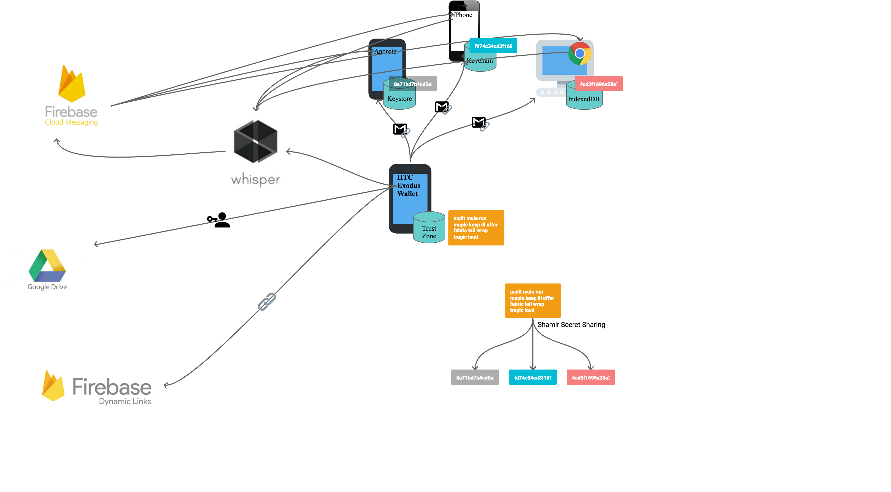
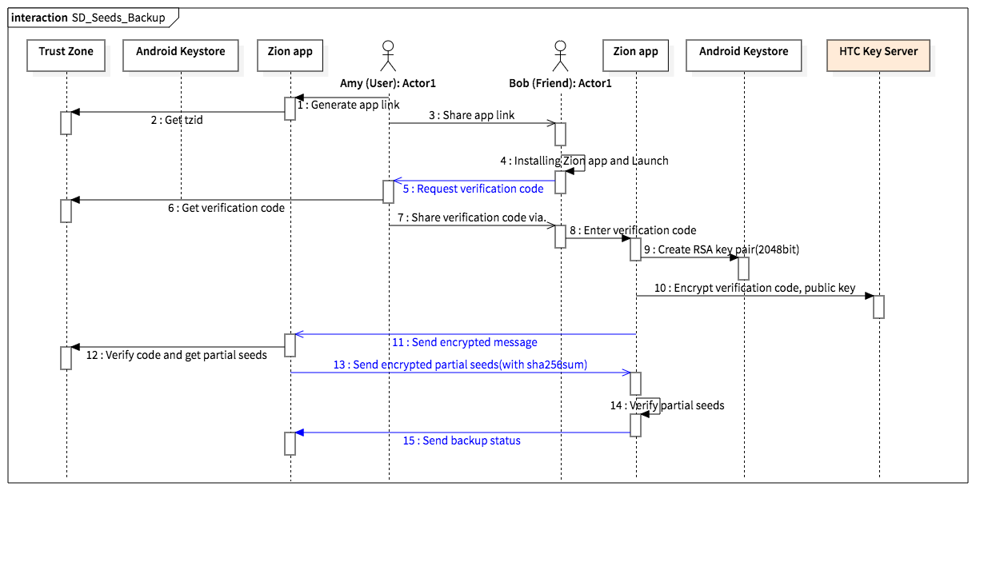
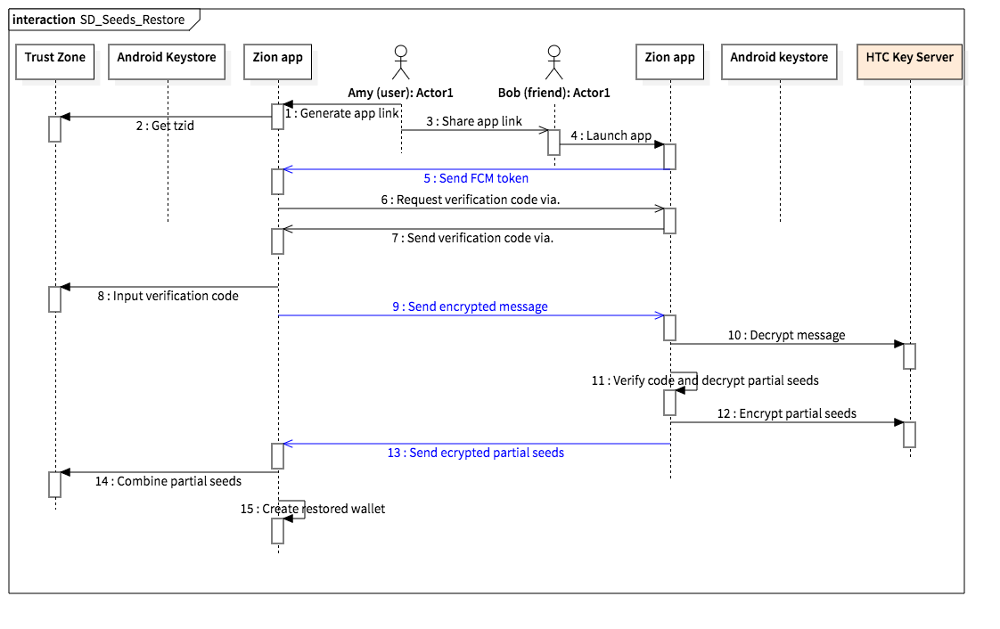

## Social Key Recovery Design and Implementation

### by Hank Chiu, Hankuan Yu, Justin Lin & Jon Tsai

### Introduction

Social Key Recovery aims to provide an alternative and interesting way to help user backup their cryptocurrency mnemonic phrase. Currently user needs manually to write down all his mnemonic phrase on a piece of paper and locks it in a safe, which is troublesome to user. To solve user’s pain in backup, Social Key Recovery tries to propose a social way to help user backup their mnemonic phrase. The idea is dividing the mnemonic phrase into several pieces and sends them to few trusted friends via the social channel that user is communicating with their friends. Each friend only gets a piece of the secret, e.g., 1/5. And thanks to the secret sharing mechanism, e.g., the Shamir secret sharing, user can restore their mnemonic phrase from only partial of the backups, e.g., user would just need to collect secrets from 3 friends when he sent out to 5 friends; moreover, even some friends have bad intention, he or she still needs to get at least 3 of them to recovery the mnemonic phrase.

The design of Social Key Recovery will have to solve the following questions:

1.  How can user connect with their friends?
2.  How can user verify their friends as trusted?
3.  How can we make sure the user data is secure and not compromise by the weakness of Android?
4.  How can we solve the data at friend's side might missing, e.g., phone stolen, app uninstalled... etc?

### Architecture

The below architecture describes the components involved when we implement the Social Key Recovery.

- Zion app
    + Android
        * The Android app is used as a blockchain wallet, it can help user manage their's blockchain asset and also can help user's friend to backup their mnemonic phrase (published on Google play store).
    + iOS
        * The iOS app can help user's friend to backup their mnemonic phrase (published on iOS app store).
    + Desktop
        * The Chrome plugin can help user's friend to backup their mnemonic phrase (Under development).
- Trust Zone
    + TEE
        * The mnemonic phrase is securely saved in Trust Zone.
        * The Shamir secret sharing is implemented in Trust Zone. The SSS implementation is using SSS from dsprenkels. [https://github.com/dsprenkels/sss](https://github.com/dsprenkels/sss). Only the **encypted** partial seed will be sent out to Android.
- Cloud storage
    + Cloud storage is only used for saving user's trusted contact list. It is to help user remembering who they have asked to help backup. In future, we are considering move the data from Google Drive to IPFS, where user might need to access it with their DID.
- Cloud messaing
    + The data exchanging are using cloud messaing. Current implementation is using Firebase Cloud Messaging (FCM) and we are implementing the messaging with Whisper system, where the message will be exchanged with Whisper and FCM will only be used for push notifcation.
- Deep link
    + The deep link is used for initial connection set up. Current implementation is using Firebase Dynamic Links.

### Flow

#### Backup

1.  User Amy launch Zion app and create app link (using Firebase Dynamic Links) to share with her friend, Bob.
2.  Zion app get tzid from Trust Zone. tzid is used to query device's public key on HTC Key Server. Each device has a paired public key stored on HTC Key Server. The data encrypted with this specific device public key can only be decrypted by the Trust Zone on this device.
3.  Amy share app link to Bob with a messaging app, e.g., Line, Whatsapp, Email…etc.
4.  Bob installed Zion app from app link and launch app, app will start at the verification code page.
5.  When Bob requesting verification code, his fcm_token is also sent to Amy to establish their FCM connection.
6.  Amy gets verification code request and click it to generate the verification code for Bob, which is displayed via secure UI (Amy needs to enter passcode).
7.  Amy sends verification code to Bob with a messaging app or phone call.
8.  Bob inputs the verification code in Zion app.
9.  Bob’s Zion app creates an RSA key pair (2048bit).
10. Bob’s Zion app uses tzid (from #3) to ask HTC key server to encrypt the verification code (from #7) and public key (from #9).
11. Bob’s Zion app sends the encrypted message (from #10) to Amy’s Zion app.
12. Amy’s Zion app receives the encrypted message and pass to Trust Zone to verify, which is if verification code (from #6) matches, if matches, then return the partial seeds (1 of 5) encrypted by Bob’s public key.
13. Amy’s Zion app sends the encrypted partial seeds to Bob.
14. Bob’s Zion app receives the encrypted partial seeds and verify the integrity by sha256sum.
15. Bob’s Zion app routinely sends backup status to Amy’s Zion app.

#### Restore

1.  Amy creates app link to share.
2.  Zion app gets tzid from Trust Zone.
3.  Amy shares app link to Bob and other friends via a messaging app.
4.  Bob clicks the app link and launch Zion app.
5.  Bob’s Zion app sends fcm_token to Amy to establish FCM connection.
6.  Bob’s Zion app generate a random verification code from app link.
7.  Bob sends the verification code to Amy with a messaging app.
8.  Amy inputs the verification code in secure UI. Verification code is encrypted with the HTC Key Server’s public key (preloaded in Trust Zone, can be updated by FOTA).
9.  Amy’s Zion app sends the encrypted message (from #8) to Bob.
10. Bob’s Zion app asks HTC Key Server to decrypt the message and verify the verification code (from #6).
11. After code verified, Bob’s Zion app decrypted the partial seeds, which is encrypted in #7.1.12.
12. Bob’s Zion app uses tzid (from #2) to ask HTC Key Server to encrypt the partial seeds.
13. Bob’s Zion app sends the encrypted partial seeds to Amy.
14. After Amy collects 3 friends’ partial seeds, she can proceed to combine seeds.
15. After seeds combined, the wallet is restored.

#### Questions to answer

By using our design, below are answers to questions at beginning.

1.  How can user connect with their friends?
    - User first share app link to their friend with communication app and their token are exchanged with app link.
2.  How can user verify their friends as trusted?
    - Friend needs to get verification code from user. Verification code will be passed from communication channel that user is connecting with their friends, e.g., phone, whatsapp, email. After the verification process, the FCM channel between user and friend are consider as trusted.
3.  How can we make sure the user data is secure and not compromise by the weakness of Android?
    - User's blockchain data are saved in Trust Zone and the data (e.g., partial seeds spilt by SSS) are encrypted with friend's public key, so even the user cannot view the data within Android world.
4.  How can we solve the data at friend's side might missing, e.g., phone stolen, app uninstalled... etc?
    - Zion app at friend's side will rountinely report backup status to user's device.
